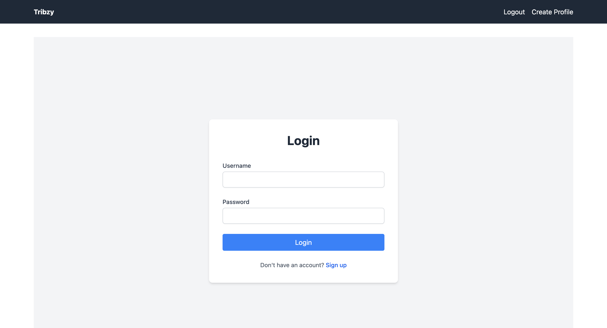
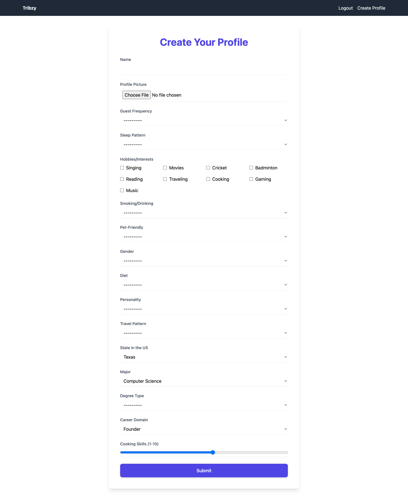
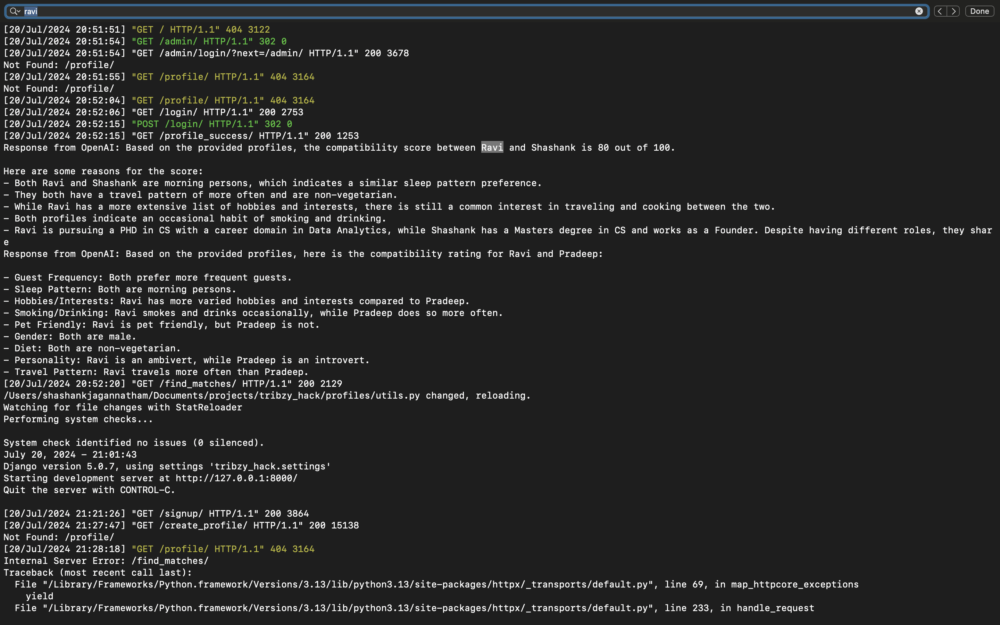

# Tribzy - Roommate Matching Platform

## Introduction
Tribzy is a revolutionary platform designed to streamline the process of finding compatible roommates for students and young professionals. Our platform leverages advanced AI algorithms to provide highly accurate roommate matches based on user profiles and preferences. This project was developed during the Austin AI Community Hackathon!

## Features
- **User Profile Creation**: Create detailed profiles with preferences, habits, and interests.
- **AI-Powered Matching**: Utilize OpenAI's language model to determine compatibility between profiles.
- **Dynamic Matching**: Receive real-time updates on potential matches.
- **Enhanced User Experience**: Clean, intuitive interface with Tailwind CSS.

## Technical Details
- **Backend**: Django, SQLite
- **Frontend**: Tailwind CSS, HTML
- **AI Integration**: OpenAI's GPT-3.5-turbo

## Installation
1. **Clone the repository**:
    ```sh
    git clone https://github.com/yourusername/tribzy.git
    cd tribzy
    ```

2. **Create and activate a virtual environment**:
    ```sh
    python3.9 -m venv myenv
    source myenv/bin/activate
    ```

3. **Install dependencies**:
    ```sh
    pip install -r requirements.txt
    ```

4. **Run migrations**:
    ```sh
    python manage.py makemigrations
    python manage.py migrate
    ```

5. **Create a superuser**:
    ```sh
    python manage.py createsuperuser
    ```

6. **Run the server**:
    ```sh
    python manage.py runserver
    ```

## Usage
1. **Sign up**:
    - Navigate to the signup page and create an account.

2. **Create Profile**:
    - Fill in your profile details, including preferences, habits, and interests.

3. **Find Matches**:
    - Once your profile is created, use the matching feature to find compatible roommates.

## Contributing
1. Fork the repository.
2. Create a new branch (`git checkout -b feature-branch`).
3. Make your changes.
4. Commit your changes (`git commit -m 'Add some feature'`).
5. Push to the branch (`git push origin feature-branch`).
6. Open a pull request.

## License
This project is licensed under the MIT License.

## Screenshots
1. **Login Page**:
   
2. **Create Profile Page**:
   
3. **Profile Success Page**:
   

## Contact
For more information, please contact tribzyco@gmail.com

